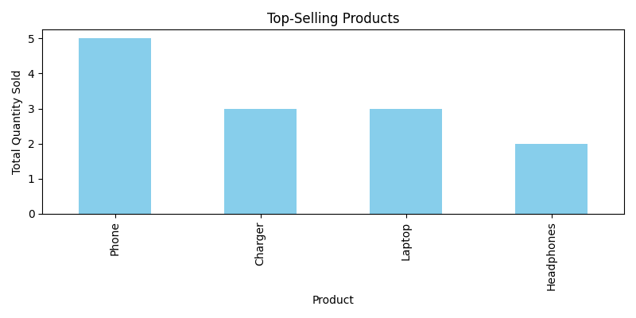
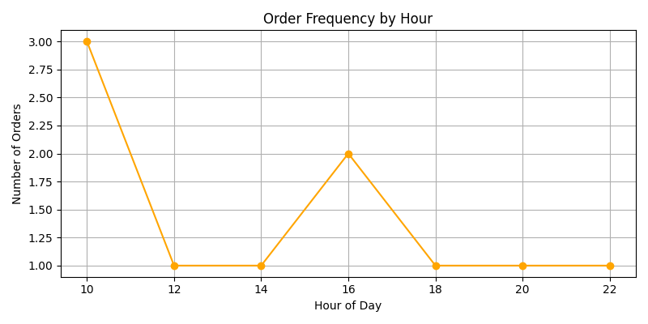

# 🛍️ Project 5: E-Commerce Data Insights

## 🎯 Objective
To uncover useful insights from an e-commerce dataset involving product sales and user behavior.

## 🛠️ Tools Used
- Python
- pandas
- matplotlib
- seaborn

## 📁 Dataset
- Fields: Order ID, User ID, Product, Quantity, Order Time, Rating
- Records: 10 (sample data)

## 📊 Analysis Performed
- Bar chart for top-selling products
- Line chart for order frequency by hour
- Average rating per product (printed)

## 📸 Output
  

## 👩‍💻 Author
Suparna Chaudhari 
